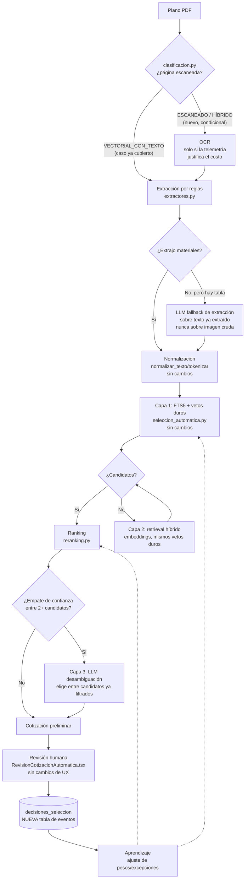

# Proyecta V2 — Arquitectura de siguiente generación para recomendación de materiales

Documento de diseño, no de implementación. Ningún código de este documento está escrito todavía; es una propuesta para revisar y aprobar antes de tocar el motor actual.

## 0. Resumen ejecutivo

El sistema actual (`seleccion_automatica.py` + `busqueda.py`/FTS5 + `reranking.py` + `equivalencias.py`/`especificaciones.py`) es 100% determinístico, sin IA ni embeddings, y acaba de demostrar sus rendimientos decrecientes: cinco mejoras de reglas sucesivas llevaron la cobertura de 22.5% a 47.9% con cero falsos positivos, y la causa dominante del 52% restante ya no es un bug del algoritmo sino ausencia real de productos en el catálogo o formatos de plano que los extractores de reglas no cubren.

La propuesta **no reemplaza** ese motor — lo **envuelve** en una cascada de capas de costo creciente: reglas deterministas primero (gratis, rápidas, ya calibradas), retrieval semántico con embeddings como red de seguridad (barato), y un LLM acotado solo en los 2-3 puntos donde generalizar a lo no visto vale más que su costo/latencia/no-determinismo. El LLM nunca decide solo: todo lo que proponga pasa por los mismos vetos duros de medida/categoría/repuesto que ya existen y que son la razón de los cero falsos positivos actuales.

Hallazgo clave de la investigación: **hoy no existe ningún componente de aprendizaje, ni de OCR, ni de historial de proyectos, ni ningún uso de LLM/embeddings en absolutamente ningún punto del backend.** Todo lo que sigue es diseño desde cero sobre esos cinco frentes, no una migración de algo que ya funciona parcialmente.

## 1. Mapa verificado del sistema actual

| Pieza | Mecanismo real | ¿Probabilístico/ML/LLM? |
|---|---|---|
| OCR | **No existe.** `lectura_planos/clasificacion.py` detecta hojas `ESCANEADO` pero no las procesa — solo extrae de la capa de texto nativa del PDF (`fitz`/`pdfplumber`) | No aplica |
| Extracción de materiales | Extractores por regex/tablas, uno por tipo de lámina (cuadros de puertas/ventanas/acabados, cómputo estructural, modelo de edificio) — patrón plugin en `lectura_planos/extractores.py` | No |
| Normalización | `busqueda.py::normalizar_texto/tokenizar` — acentos, minúsculas, sinónimos fijos | No |
| Equivalencias | `equivalencias.py` (veto de repuesto/accesorio) + `especificaciones.py` (conflicto duro de specs físicas por regex) | No |
| Familias | `familias.py::calcular_familias()` — batch manual, **solo Pinturas habilitada**, agrupa por `firma_base` (nombre sin tamaño de envase) | No |
| Búsqueda FTS | SQLite FTS5 + bm25, `reranking.py` reordena con señales léxicas fijas (posición, frase exacta, cobertura de tokens, penalización de "repuesto de") | No |
| Embeddings | No existe | — |
| LLM | No existe — 0 hits reales de OpenAI/Anthropic/embeddings en todo el backend | — |
| Aprendizaje de decisiones | **No existe.** `items_proyecto.revisado`/`confianza_match` son flags de UI; nada los lee para aprender | No (no hay nada que aprenda) |
| Historial de proyectos | **No existe.** Todas las consultas de proyectos filtran estrictamente por `propietario_id`; no hay noción de "tipo de proyecto" ni cruce entre usuarios | No aplica |
| Proveedores/catálogo | 6 proveedores (EPA, Brenes, Carbone, Construplaza, El Lagar, Novex), ~60k productos. Actualización **manual/on-demand** — el cron nocturno está documentado pero nunca desplegado | No aplica |
| Confianza | 3 sistemas de buckets categóricos independientes (alta/media/baja), todos por umbrales fijos sobre señales léxicas/specs | No |

## 2. Análisis por componente para V2

### OCR
- **Ventajas**: cubre planos escaneados/fotografiados, hoy 100% invisibles para el sistema.
- **Desventajas**: introduce error de reconocimiento sobre texto técnico (medidas, códigos de producto), requiere normalización adicional para absorber ese ruido.
- **Costo**: Tesseract es gratis pero de precisión pobre en planos con texto rotado/pequeño; OCR cloud (Google Vision, ~US$1.50/1000 páginas) o LLM con visión (~US$0.01–0.03/página) dan mejor precisión a mayor costo.
- **Complejidad**: media — nuevo stage de pipeline, pero el enrutamiento ya existe (`clasificacion.py` ya distingue `ESCANEADO`).
- **Impacto esperado**: **desconocido hoy** — no hay telemetría de qué fracción de planos reales de usuarios cae en `ESCANEADO`/`HIBRIDO`. No se debe invertir aquí sin medir primero (ver Fase 3, prioridad baja).

### Extracción de materiales
- **Ventajas de mantener reglas**: gratis, instantáneo, determinístico, ya validado (77/77 hojas `VECTORIAL_CON_TEXTO`).
- **Desventajas de mantener solo reglas**: cada despacho de arquitecto con un formato de cuadro distinto requiere un extractor nuevo escrito a mano — no generaliza.
- **Propuesta**: LLM como **fallback**, no como reemplazo — invocado solo cuando los extractores de reglas devuelven 0 materiales de una lámina que sí contiene una tabla reconocible (dato objetivo: hay tabla, no hubo extracción). Corre sobre el **texto/tabla ya extraído** (pdfplumber), no sobre la imagen cruda — mucho más barato y con menos superficie de alucinación.
- **Costo**: con modelo económico (Haiku/GPT-4o-mini) sobre texto ya extraído, centavos de dólar por lámina fallida.
- **Complejidad**: alta — necesita structured output con schema estricto (cantidad, medida, descripción) y validación de que los números devueltos existen literalmente en el texto fuente, nunca inventados.
- **Impacto esperado**: potencialmente el mayor salto de cobertura del extremo "extracción", pero no medible sin antes contar cuántas láminas reales producen 0 materiales hoy.

### Normalización de nombres
- **Propuesta**: no tocar. `normalizar_texto`/`tokenizar` es la base de indexación de todo el sistema (FTS5, equivalencias, similares, selección automática) — barata, rápida, ya calibrada contra el catálogo real. Ningún componente nuevo debe evitarla o duplicarla.
- **Impacto de no invertir aquí**: neutro — no es el cuello de botella actual.

### Equivalencias
- **Propuesta**: mantener el veto duro de specs físicas (`especificaciones.py`) exactamente como está — es lo que impide sustituir un tornillo de calibre distinto o una tubería SCH incompatible, y no debe volverse "blando" nunca, sin importar qué tan sofisticado sea el resto del sistema.
- Único cambio de bajo riesgo: usar el LLM para matizar `EQUIVALENCIA_PROBABLE` con una explicación en lenguaje natural (UX, no lógica de negocio) — prioridad baja.

### Familias
- **Ventajas de expandir**: hoy solo Pinturas se beneficia de agrupación de familias; el resto del catálogo (>95%) no.
- **Desventajas de expandir con la regla actual**: el propio código documenta por qué la heurística de "presentación" no es segura para Tornillos/Cable/Tubería — falso positivo caro si se fuerza.
- **Propuesta**: clustering por **embeddings** de nombre+categoría en categorías nuevas, con umbral conservador y **validación manual por muestreo antes de habilitar cada categoría** — mismo principio de "medir antes de aceptar" de esta sesión, aplicado a un componente nuevo.
- **Costo/complejidad**: bajo/media — es un job batch offline, no una consulta en vivo.
- **Impacto esperado**: medio, mejora la calidad de "productos similares" y de descuentos por familia, no la cobertura de selección desde plano directamente.

### Búsqueda FTS
- **Propuesta**: se mantiene como **primera etapa siempre** (recall léxico, gratis, milisegundos). No se reemplaza por vector search — se complementa.

### Embeddings
- **Ventajas**: capturan sinónimos/jerga regional que `equivalencias.py` no tiene codificados a mano, mucho más barato que un LLM por consulta (milisegundos, centavos por millones de consultas con un modelo liviano).
- **Desventajas**: no entienden restricciones físicas duras (medida, voltaje) — deben combinarse con los vetos duros existentes, nunca reemplazarlos. Requieren indexar y mantener ~60k vectores.
- **Costo**: indexación inicial de un solo dígito de dólares (modelo liviano tipo `multilingual-e5-small`, corre en CPU); actualización incremental cuando cambia el catálogo.
- **Complejidad**: media — nueva tabla de vectores + índice de similaridad (ver §5).
- **Propuesta de uso concreto**: retrieval híbrido como **fallback de FTS5**, activado solo cuando `buscar_fts`/`_buscar_con_relajacion` devuelven cero candidatos (exactamente los casos `sin_candidatos_busqueda` de hoy). Los candidatos que aporte pasan por los **mismos** vetos duros de `seleccion_automatica.py` sin excepción.
- **Impacto esperado**: no medible sin antes clasificar cuántos de los 37 materiales sin match actuales son "el producto existe con otro nombre" vs. "el producto no existe en el catálogo" — ver §7.

### LLM
- **Dónde SÍ agrega valor real** (los únicos 3 puntos propuestos):
  1. Fallback de extracción cuando las reglas devuelven 0 materiales de una lámina con tabla reconocible (§ arriba).
  2. Desambiguación cuando dos o más candidatos **ya sobrevivieron** los vetos duros con confianza empatada — el LLM elige entre una lista cerrada de 3–5 SKUs pre-filtrados, nunca genera un candidato nuevo.
  3. Explicación en lenguaje natural de por qué se eligió un producto — puramente de UX, cero impacto en qué se selecciona.
- **Dónde NO se usa**: nunca como motor de matching masivo (70 materiales × llamada por material sería lento y caro), nunca con permiso de saltarse un veto duro, nunca generando cantidades/medidas nuevas.
- **Costo**: acotado a los 2-3 puntos de arriba, no a todo el catálogo — estimado en centavos de dólar por plano con modelos económicos, no dólares.
- **Complejidad**: alta — structured output con schema estricto, `temperature=0`, validación de que la salida es un ID de un candidato ya filtrado (no texto libre convertible en producto nuevo), timeout/fallback si la API falla.
- **Riesgo central a documentar**: el LLM propone, el motor de reglas dispone. Todo lo que sugiera se re-valida contra los vetos de medida/categoría/repuesto existentes antes de tocar una cotización.

### Aprendizaje basado en decisiones de usuarios
- **Estado real**: no existe ningún dato de "qué reemplazó el usuario por qué" — solo un booleano de "revisado".
- **Fase 1 (prerequisito de todo lo demás)**: tabla de eventos `decisiones_seleccion` (sku propuesto, sku final elegido por el usuario, término de búsqueda, confianza original, timestamp) — pura instrumentación, sin modelo. Sin esto no hay aprendizaje posible más adelante.
- **Fase 2**: con esos datos, ajustar manualmente pesos/excepciones existentes en `reranking.py` (ej. "este SKU es sistemáticamente reemplazado cuando aparece este término" → tabla de excepciones, no un modelo).
- **Fase 3 (opcional, requiere volumen real)**: reranker ligero (regresión logística sobre las mismas señales léxicas ya usadas hoy) que aprenda los pesos en vez de tenerlos fijos a mano — mantiene explicabilidad, no es una red neuronal.
- **Impacto esperado**: bajo en el corto plazo (depende de volumen real de usuarios que hoy no existe), alto a mediano plazo.

### Historial de proyectos
- **Estado real**: no existe ninguna noción de "tipo de proyecto" ni cruce entre usuarios.
- **Propuesta**: prerequisito de datos (clasificar proyectos por tipo/tamaño) antes de poder usar cotizaciones pasadas como prior de materiales típicos. Impacto especulativo hasta tener volumen — no priorizar en las primeras fases.

### Proveedores
- **Estado real**: catálogo actualizado manualmente, sin cron real desplegado pese a estar documentado.
- **Propuesta**: automatizar el cron real es un prerequisito **operativo**, no algorítmico, para escalar a miles de usuarios — un catálogo desactualizado degrada cualquier motor, por sofisticado que sea. Complejidad baja (DevOps), impacto alto en confiabilidad.

### Confianza por recomendación
- **Propuesta**: mantener el patrón de 3 buckets categóricos (alta/media/baja) — más legible para el usuario final que un score numérico, y evita falsa precisión. Si se agregan embeddings/LLM, sus salidas se **traducen** a los mismos 3 buckets existentes; no se introduce un cuarto sistema de confianza paralelo.

## 3. Principio rector: cascada de costo creciente

Cada material intenta resolverse en la capa más barata posible primero, y solo escala a la siguiente cuando la anterior falla o no alcanza confianza suficiente:

```
1. Reglas deterministas (FTS5 + vetos duros)   -- gratis, milisegundos, ya calibrado
2. Retrieval híbrido con embeddings             -- barato, milisegundos, solo si (1) no encontró nada
3. LLM acotado (extracción/desambiguación)      -- costoso, segundos, solo si (1) y (2) no alcanzan
```

Esto minimiza costo por consulta, tiempo de respuesta y dependencia de un LLM — los tres objetivos explícitos de esta misión. La mayoría de los 70 materiales de un plano típico nunca deberían tocar la capa 3.

## 4. Arquitectura propuesta



Las cajas marcadas "sin cambios" son exactamente el sistema actual — nada de lo que ya funciona con cero falsos positivos se reemplaza; el diseño lo envuelve.

## 5. Tecnologías recomendadas

- **Embeddings**: modelo multilingüe liviano (ej. `multilingual-e5-small` o equivalente), corre en CPU — el catálogo (~60k productos) no justifica GPU. Almacenamiento: `sqlite-vec` (extensión de SQLite para vectores) para no introducir una base de datos nueva junto a la ya existente; si el rendimiento no alcanza, un índice HNSW en archivo cargado en memoria del proceso.
- **LLM**: modelo económico con salida estructurada (function calling / JSON Schema estricto), `temperature=0`, acotado a devolver solo IDs de candidatos ya filtrados o campos ya presentes en el texto fuente — nunca texto libre convertible en un producto o cantidad nueva. Cliente abstraído detrás de una interfaz propia (no un SDK específico hardcodeado en el núcleo), para poder cambiar de proveedor sin tocar la lógica de negocio.
- **Base de datos**: se mantiene FastAPI + SQLite. No hay indicio de que el volumen actual requiera Postgres/vector DB dedicado — `sqlite-vec` cubre el caso de uso sin ese salto operativo.
- **Resiliencia**: si el LLM no está disponible (timeout, error, presupuesto agotado), el sistema debe degradar a la cobertura actual (capas 1 y 2), nunca fallar la cotización completa.

## 6. Plan de implementación por fases

| Fase | Contenido | Riesgo | Depende de |
|---|---|---|---|
| **0** | Instrumentación: tabla `decisiones_seleccion` + cron real de actualización de catálogo desplegado | Bajo | — |
| **1** | Retrieval híbrido (embeddings) como fallback de FTS5, mismos vetos duros | Bajo–medio | Fase 0 (catálogo actualizado) |
| **2** | Medir telemetría real: % de planos con páginas `ESCANEADO`/`HIBRIDO`, % de láminas con tabla pero 0 materiales extraídos | Ninguno (solo medición) | — |
| **3** | LLM fallback de extracción, **solo si** la Fase 2 muestra volumen real del problema | Medio–alto | Fase 2 |
| **4** | LLM de desambiguación en empates de confianza | Medio | Fase 1 |
| **5** | Aprendizaje de pesos supervisado simple sobre datos de Fase 0 | Bajo, pero requiere volumen de uso real | Fase 0 + tráfico real |
| **6** (especulativa) | OCR para planos escaneados, solo si Fase 2 lo justifica | Medio | Fase 2 |

No se recomienda arrancar la Fase 3 o la Fase 6 sin haber corrido la Fase 2 primero — sería repetir, en un componente nuevo y más caro, el mismo error que esta sesión evitó explícitamente: invertir en una mejora sin medir primero si el problema que ataca es real y de qué tamaño.

## 7. Impacto esperado sobre cobertura

Cifra de partida: 47.9% de cobertura, cero falsos positivos confirmados, medida contra los mismos 2 PDFs de referencia.

**Con honestidad explícita: no tengo el dato para prometer un número.** Lo que sí puedo dar es un rango condicionado a una medición pendiente:

- De los 37 materiales sin match actuales, la clasificación de causas de esta misma sesión ya separó "ausencia real en catálogo" (acabados especializados como Chukum/EKOWOOD, medidas fuera de rango) de otras causas — pero no until ahora con el detalle de cuántos son específicamente "el producto existe con un nombre/sinónimo distinto". **Ese conteo es el primer paso de la Fase 1, no un supuesto de este documento.**
- Si esa fracción resulta ser, por ejemplo, 30–40% de los sin-match (rango plausible pero no medido), el retrieval híbrido podría llevar la cobertura a un rango de ~55–62%. Si resulta ser menor, el impacto será menor. **Este número se reporta como hipótesis a validar, no como compromiso.**
- El fallback de extracción por LLM (Fase 3) tiene impacto **no estimable hoy**: no existe telemetría de cuántos planos reales de usuarios tienen formatos no cubiertos por los extractores actuales.

## 8. Riesgos técnicos

- **No determinismo del LLM**: dos corridas del mismo plano podrían dar resultados distintos — grave en un sistema de cotización. Mitigación: `temperature=0` y, sobre todo, que el LLM nunca decida solo — siempre pasa por los vetos duros determinísticos existentes.
- **Costo variable**: sin límites duros, el uso de LLM puede crecer sin control. Mitigación: acotarlo estrictamente a los 2-3 puntos de §2, con métricas de costo por plano y límites duros de invocaciones.
- **Latencia**: una llamada LLM por material (hasta 70 por plano) puede convertir una cotización de segundos en minutos. Mitigación: usarlo solo como fallback de baja frecuencia, nunca como primera línea.
- **Alucinación de cantidades/medidas**: crítico en un dominio donde un error de cantidad es dinero real del cliente. Mitigación: el LLM nunca genera números nuevos, solo elige entre candidatos ya extraídos o corrobora texto ya presente en la fuente.
- **Dependencia de proveedor externo**: mitigar con una interfaz propia (no un SDK hardcodeado) y degradación garantizada a la cobertura actual si el LLM no responde.
- **El catálogo como techo real**: ya confirmado empíricamente en esta sesión — ningún componente de V2 soluciona la ausencia total de un producto en los 6 proveedores actuales. Ampliar catálogo (nuevos proveedores, categorías de nicho) puede tener **más impacto que cualquier mejora algorítmica**, y debe evaluarse como alternativa/complemento, no como algo fuera del alcance de esta propuesta.

## 9. Prioridades recomendadas

1. Fase 0 — instrumentación de decisiones + cron real de catálogo (fundacional, barato, sin riesgo).
2. Fase 1 — retrieval híbrido con embeddings (impacto medible, no toca lo que ya funciona).
3. Fase 2 — medir telemetría real de OCR/extracción antes de comprometerse a construir cualquiera de las dos.
4. Fase 3/6 — solo si la Fase 2 confirma volumen real del problema.
5. Fase 4 — desambiguación LLM (volumen esperado bajo, prioridad baja).
6. Fase 5 — aprendizaje de pesos (no se puede acelerar; depende de tráfico real de usuarios).

## 10. Qué NO cambia

`seleccion_automatica.py`, `busqueda.py`, `reranking.py`, `equivalencias.py`, `especificaciones.py` y el flujo de revisión humana (`RevisionCotizacionAutomatica.tsx`) se mantienen exactamente como están. V2 los envuelve, no los reemplaza — las garantías de precisión ganadas mejora a mejora en esta sesión (cero falsos positivos confirmados) son la base sobre la que se construye todo lo demás, no algo que se negocia a cambio de más cobertura.
